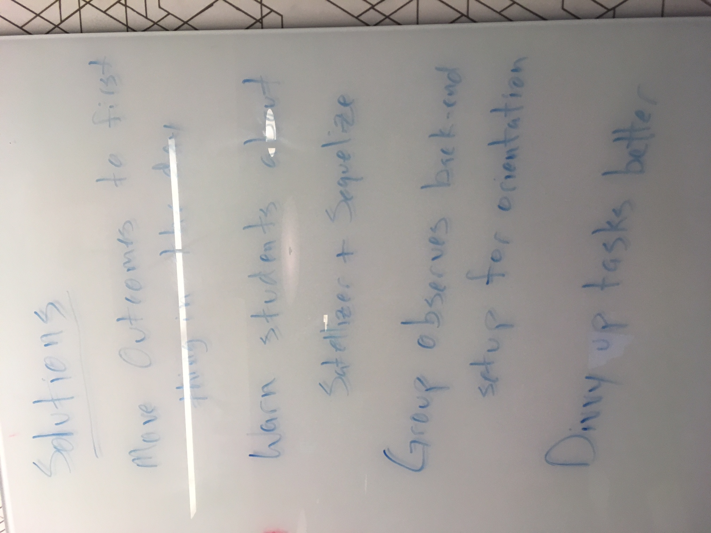
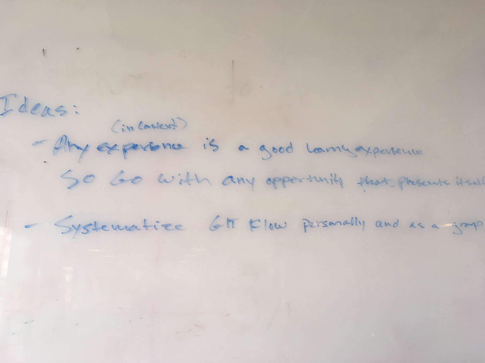
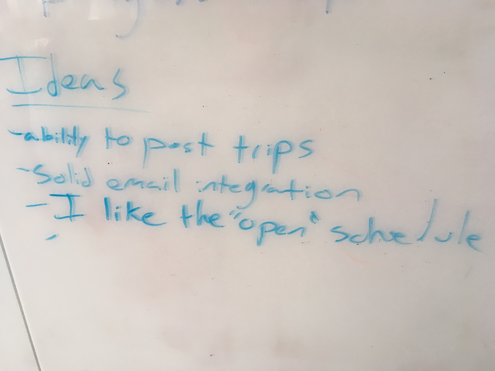

# Notes on Improvement from Cohort 2

## General Ideas

## Unit 1

In general, the students felt that:

- We covered way too much
- We should have cut anything non-essential and just taught exactly what we needed to get Project 1 done
- Whiteboarding was fun, but scary
- Pre-work was too difficult, and they wanted more support while doing it
- They would have liked more modeling and instructors running through solutions
- It would be useful for all labs and lessons to specify
  - The thing we built
  - What technology they learned

And here are the ideas from Project 1 Retro:

## Unit 2

In general, the students felt that:

- We should have introduced, visually, at a high level, the path we were going to take through this unit
- We should have introduced APIs at the end of the unit so we don't get them confused by two different types of requests, at the least we should have separated those ideas with enough time
- Project 2 week was too short

There may be room here for non-technical lightning talks, to get devs used to teaching.  It will build empathy and public speaking, as well as confidence that they know a lot about things.

And here are the ideas from Project 2 Retro:

## Unit 3

In general, the students felt that:

We only spend about an hour each on passport and satellizer, but they're project requirements - it would be nice to reuse those components again and again on other labs leading up to the projects, cause right now they feel like they don't understand them enough to use them in projects.

And here are the ideas from Project 3 Retro:

## Unit 4

In general, the students felt that:

- Tutorials are hard.  Yes, they are.  I think a good exercise would be to have them try to write a tutorial.  Something really small, but to get their head around how hard it is, and that the tutorial community is not just a bunch of freebies that should be perfectly written, but rather a lot of hard-working people trying to share their knowledge.
