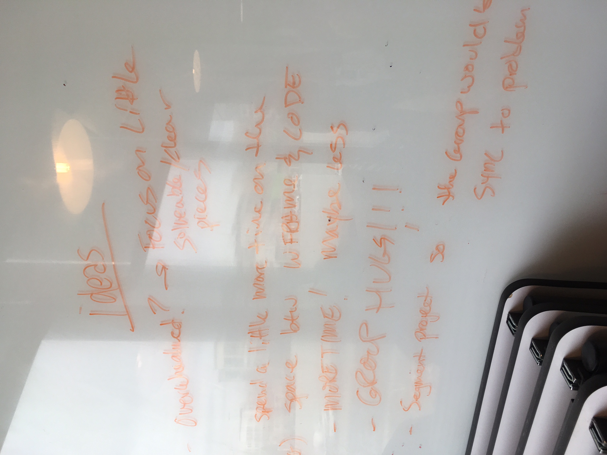

# Notes on Improvement from Cohort 2

## General Ideas

## Unit 1

In general, the students felt that:

- We covered way too much
- We should have cut anything non-essential and just taught exactly what we needed to get Project 1 done
- Whiteboarding was fun, but scary
- Pre-work was too difficult, and they wanted more support while doing it
- They would have liked more modeling and instructors running through solutions

And here are the ideas from Project 1 Retro:

## Unit 2

In general, the students felt that:

- We should have introduced, visually, at a high level, the path we were going to take through this unit
- We should have introduced APIs at the end of the unit so we don't get them confused by two different types of requests, at the least we should have separated those ideas with enough time
- Project 2 week was too short

And here are the ideas from Project 2 Retro:

## Unit 3

In general, the students felt that:

## Unit 4

In general, the students felt that:
